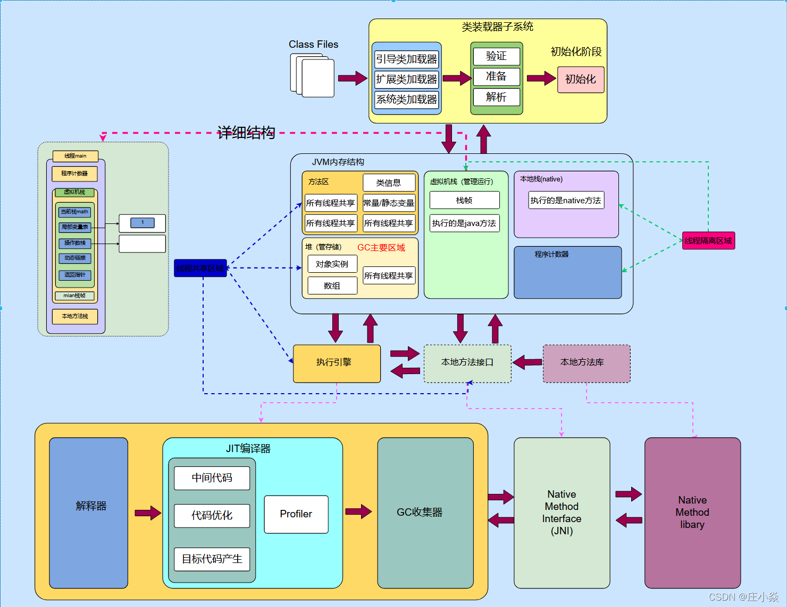
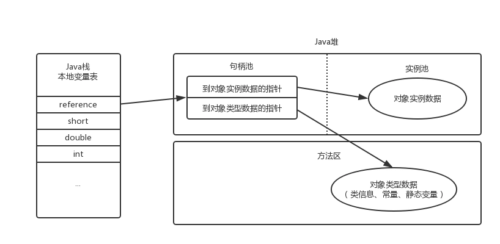
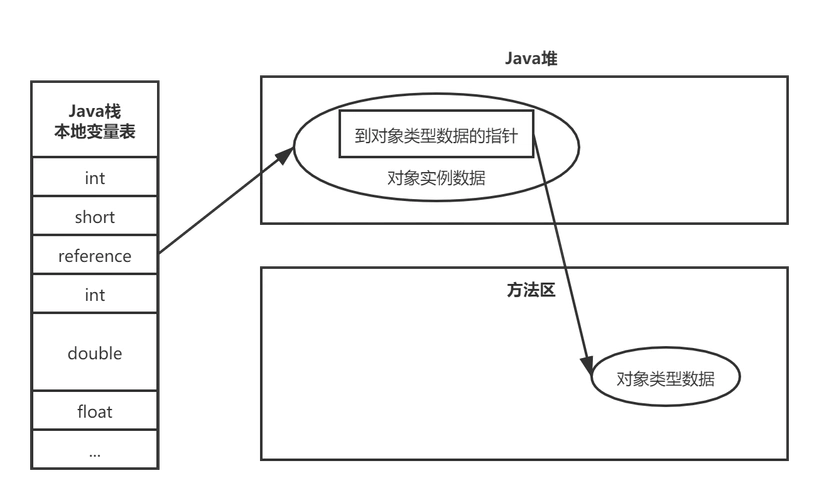
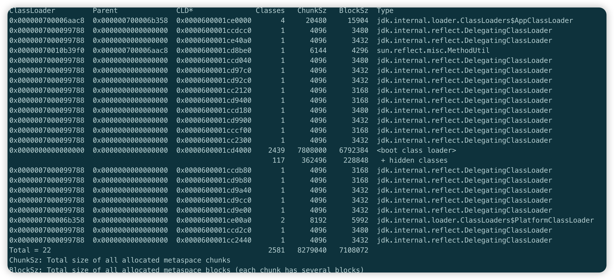

# JVM内存结构图




# 虚拟机栈

每个方法被执行的时候，Java 虚拟机都会同步创建一个栈帧(Stack Frame) 用于存储局部变量表、操作数栈、动态链接、方法出口等信息。也是线程私有的。每一个方法被调用直至执行完毕的过程，就对应着一个栈帧在虚拟机栈中从入栈道出栈的过程

> 局部变量表存放了编译期可知的各种 Java 虚拟机基本数据类型(boolean、byte、char、short、int、float、long、double)、对象引用(reference 类型，它并不等同于对象本身，可能是一个指向对象起始地址的引用指针，也可能是指向一个代表对象的句柄或者其他与此对象相关的位置) 和 returnAddress 类型（指向了一跳字节码指令的地址）


# 程序计数器

线程私有的。是一块较小的内存空间，它可以看作是当前线程所执行的字节码的行号指令器


# 本地方法栈

本地方法栈与虚拟机栈所发挥的作用是非常相似的，其区别只是虚拟机栈为虚拟机执行 Java 方法服务，而本地方法栈则是为虚拟机使用道的本地(Native) 方法服务

# 堆

Java 堆是被所有线程共享的一块内存区域，在虚拟机启动时创建。

如果从分配内存的角度看，所有线程共享的 Java 堆中可以划分出多个线程私有的分配缓冲区(Thread Local Allocation Buffer, TLAB)，以提升对象分配时的效率。将 Java 堆细分的目的只是为了更好的回收内存，或者更快的分配内存


# 方法区

方法区与 Java 堆一样，是各个线程共享的内存区域，它用于存储已被虚拟机加载的类型信息、常量、静态变量、即时编译器编译后的代码缓存等数据

## 运行时常量池

运行时常量池是方法区的一部分。Class 文件中除了有类的版本、字段、方法、接口等描述信息外，还有一项信息是常量池表，用于存放编译期生成的各种字面量与符号引用，这部分内容将在类加载后存放道方法区的运行时常量池中。


# 对象的创建

当 Java 虚拟机遇到一跳字节码 new 指令时，首先将去检查这个指令的参数是否能在常量池中定位到一个类的符号引用，并且检查这个符号引用代表的类是否已被加载、解析和初始化过。如果没有，那么必须先执行相应的类的加载过程

在加载检查通过后，接下来虚拟机将为新生对象分配内存。对象所需内存的大小在类加载完成后便可以完全去定

## 两种分配方式

### 指针碰撞

假设 Java 堆中内存时绝对规整的，所有被使用过的内存都放在一边，空闲的内存被放在另一边，中间放着一个指针作为分界点的指示器，那所分配内存就仅仅是把那个指针向空闲空间方向挪动一段与对象大小相等的距离，这种分配方式叫“指针碰撞”

### 空闲列表

但如果 Java 堆中的内存并不是规整的，已被使用的内存和空闲的内存相互交错在一起，那就没有办法简单地进行指针碰撞了，苏你记就必须维护一个列表，记录上哪些内存块时可用的，在分配的时候从列表中找到一块足够大的空间划分给对象实例，并更新列表上的记录，这种分配方式称为“空闲列表”

## 对象的内存布局

对象在堆内存中的存储可以划分为三个部份：对象头(Header)、实例数据(Instance Data) 和对齐填充(Padding)

### 对象头

对象头包括两类信息：

- 用于存储对象自身的运行时数据，如哈西吗、GC分代年龄、锁状态标志、线程持有的锁、偏向线程ID、偏向时间戳等

  | 存储内容                             | 标志位 | 状态               |
  | ------------------------------------ | ------ | ------------------ |
  | 对象哈希码、对象分代年龄             | 01     | 未锁定             |
  | 指向锁记录的指针                     | 00     | 轻量级锁定         |
  | 指向重量级锁的指针                   | 10     | 膨胀(重量级锁锁定) |
  | 空，不需要记录信息                   | 11     | GC标记             |
  | 偏向线程ID、偏向时间戳、对象分代年龄 | 01     | 可偏向             |

- 对象的另一部分是类型指针，即对象指向它的类型元数据的指针，Java虚拟机通过这个指针来去定该对象是哪个类的实例

### 实例数据

实例数据部份是对象真正存储的有效信息。即我们在程序代码里面所定义的各种类型的字段内容，无论是从父类继承下来的，还是在自类中定义的字段都必须记录起来

### 对齐填充

这个可选的，也没有特别的含义，仅仅起着占位符的作用

# 对象的访问定位

对象访问方式有两种：**句柄** 和 **直接指针**

## 句柄

如果使用句柄访问的话，Java堆中将可能会划分出一块内存来作为句柄池，reference 中存储的就是对象的句柄地址，而句柄中包含了对象实例数据与类型数据个字具体的地址信息，如下图：



## 直接指针

直接指针访问的话，Java 堆中对象的内存布局就需要考虑如何防止访问类型数据的相关信息，reference 中存储的是直接就是对象地址，如果只是访问对象本身的话，就需要多一次时间间接访问的开销，如下图：



# 内存溢出

## 堆溢出

```java
/**
 * 测试堆内存溢出
 * 添加 VM options 参数
 * -Xms2m -Xmx2m -XX:+HeapDumpOnOutOfMemoryError -XX:+PrintGCDetails
 */
public class MemoryTest1 {

    public static void main(String[] args) {
        List<MemoryTest1> list = new ArrayList<>();
        for (;;) {
            list.add(new MemoryTest1());
        }
    }
}
```

将栈信息打印出来了，也可以使用 jvisualvm，打开打印存储的 .hprof 文件，查看 dump 文件，分析内存溢出问题


## 栈溢出

```java
/**
 * 使用递归方法测试栈溢出
 * -Xss256k 设置栈内存大小
 */
public class MemoryTest2 {
    private int count;
    public void stackOverflow() {
        count++;
        stackOverflow();
    }
    public static void main(String[] args) {
        MemoryTest2 memoryTest2 = new MemoryTest2();

        try {
            memoryTest2.stackOverflow();
        } catch (Throwable e) {
            System.out.println("stack deep: " + memoryTest2.count);
            e.printStackTrace();
        }
    }
}
```


# JVM 命令


- jmap clstats PID

  > 查看某个 PID 中类加载器相关信息
  >
  > 比如，jmap -clstats 46400 得到如下结果：
  >
  > 

- jstat -gc pid

  > 查看 gc 情况
  >
  > 比如 jstat -gc 46400，得到结果如下：
  >
  > 

- jcmd

  - jcmd pid VM.flags

    > 查看某个PID启动的JVM参数，比如
    >
    > jcmd 46923 VM.flags
    >
    > 得到结果如下：
    >
    > ```markdown
    > -XX:CICompilerCount=4 -XX:ConcGCThreads=3 -XX:G1ConcRefinementThreads=11 -XX:G1EagerReclaimRemSetThreshold=64 -XX:G1HeapRegionSize=8388608 -XX:G1RemSetArrayOfCardsEntries=64 -XX:G1RemSetHowlMaxNumBuckets=8 -XX:G1RemSetHowlNumBuckets=8 -XX:GCDrainStackTargetSize=64 -XX:InitialHeapSize=805306368 -XX:MarkStackSize=4194304 -XX:MaxHeapSize=12884901888 -XX:MaxNewSize=7725907968 -XX:MinHeapDeltaBytes=8388608 -XX:MinHeapSize=8388608 -XX:NonNMethodCodeHeapSize=5839564 -XX:NonProfiledCodeHeapSize=122909338 -XX:ProfiledCodeHeapSize=122909338 -XX:ReservedCodeCacheSize=251658240 -XX:+SegmentedCodeCache -XX:SoftMaxHeapSize=12884901888 -XX:+UseCompressedOops -XX:+UseG1GC -XX:-UseNUMA -XX:-UseNUMAInterleaving
    > ```

  - jcmd pid help：列出当前运行的 Java 进程可以执行的操作

  - jcmd pid Thread.print：列出这个 pid 的线程信息

  - jcmd pid GC.heap_dump /users/xxx/Desktop/test.hprof 将堆栈信息输出到指定文件中

- jstack pid：查看或导出某个 pid 线程堆栈信息

 


