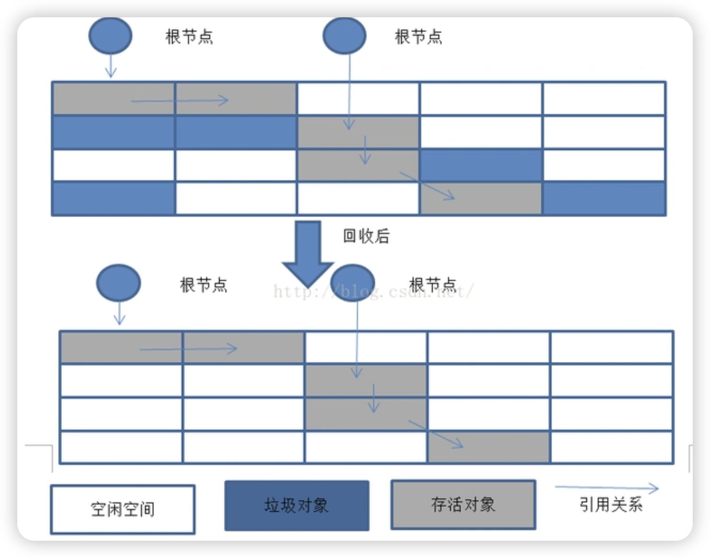
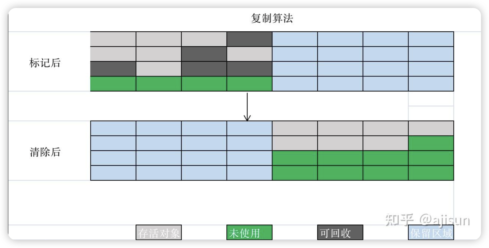
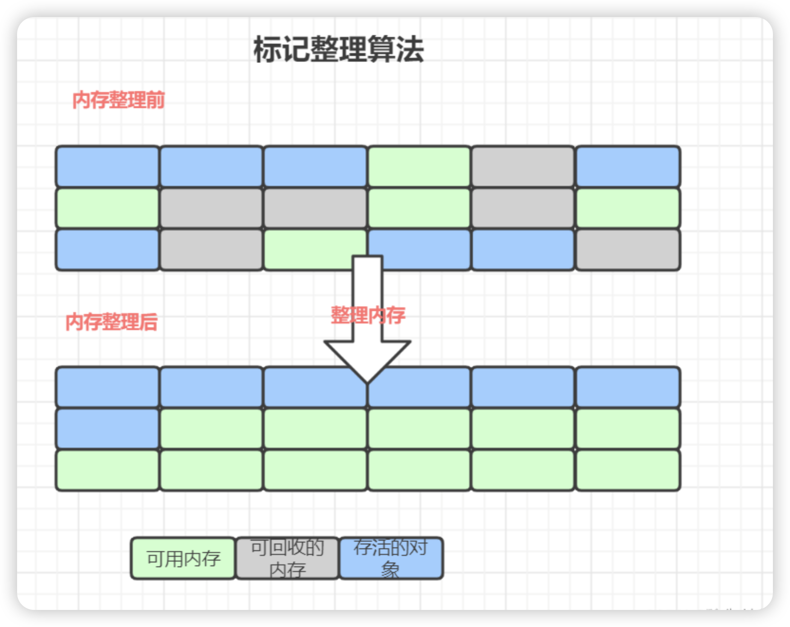
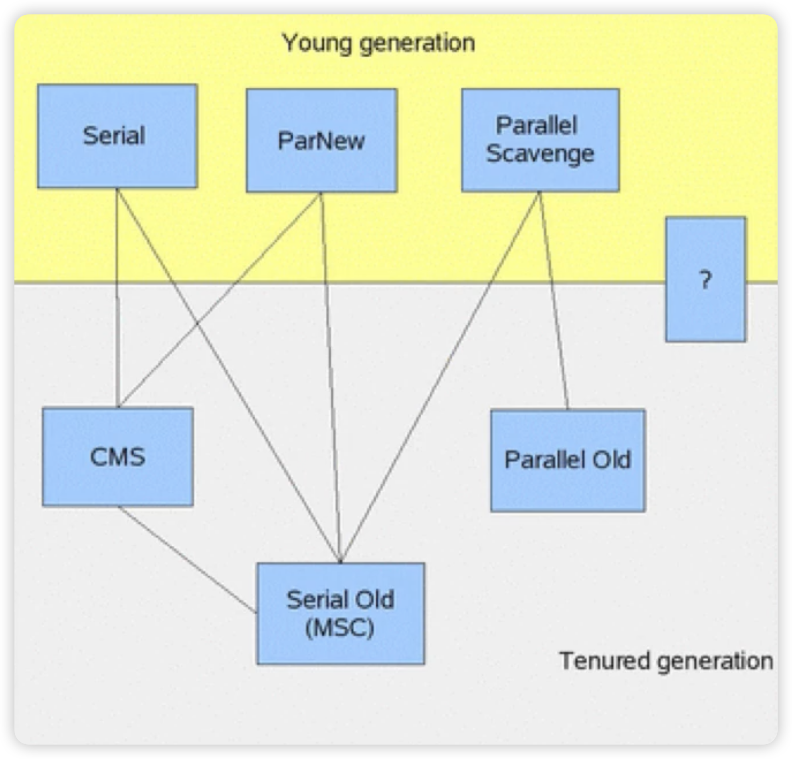
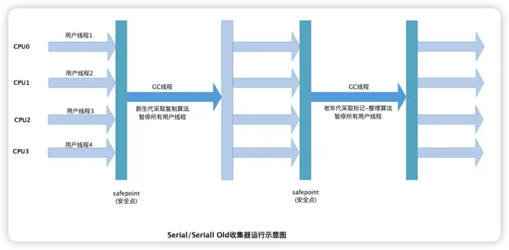
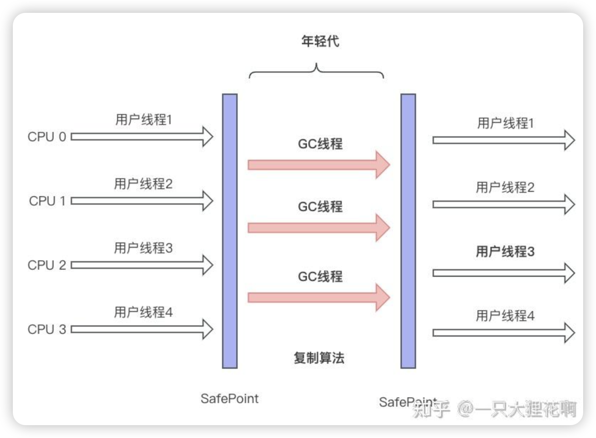
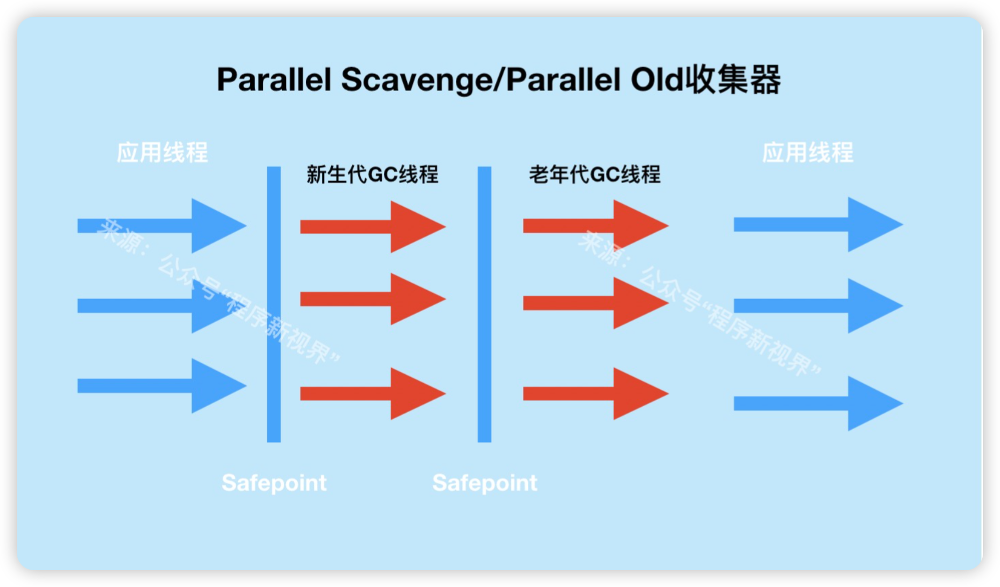
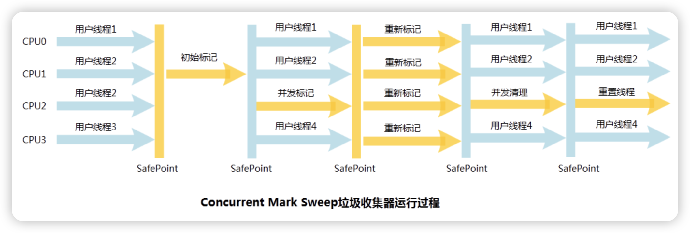

# JVM 垃圾回收

## 如何判断一个对象已死？

> 有两种算法：
>
> 1. 引用技术算法
>
>    在对象中添加一个引用计数器，每当有一个地方引用它时，计数器值就加一；当引用失效时，计数器值就减一；任何时刻计数器为零的对象就是不可能再被使用的。这种算法在 Java 领域没有选这种算法，原因是很难解决相互循环引用的问题，比如：
>
>    ```java
>    public class ReferenceCountingGC {
>      public Object instance = null;
>      private static final int _1MB = 1024 * 1024;
>      private byte[] bigSize = new byte[2 * _1MB];
>      
>      public static void testGC() {
>        ReferenceCountingGC objA = new ReferenceCountingGC();
>        ReferenceCountingGC objB = new ReferenceCountingGC();
>        objA.instance = objB;
>        objB.instance = objA;
>        
>        objA = null;
>        objB = null;
>        
>        System.gc();
>      }
>    }
>    ```
>
>    像上面的代码中就存在相互引用，使用引用计数算法就无法回收
>
> 2. 可达性分析算法
>
>    通过一系列 ”GC ROOTS“ 的根对象作为起点，从这些节点开始，根据引用关系向下搜索，搜索过程所走过的路径称为 ”引用链“，如果某个对象到 GC Roots 间没有任何引用链相连，则证明对象是不可再使用的
>
>    
>
>    **固定可作为 GC Roots 的对象包括以下几种：**
>
>    1. 在虚拟机栈中引用的对象
>    2. 在方法区中类静态属性引用的对象
>    3. 在方法区中常量引用的的对象
>    4. 在本地方法栈中 JNI 引用的对象
>    5. Java 虚拟机内部的引用，比如基本属性类型对应的 Class 对象，一些常驻的异常对象等
>    6. 所有被同步锁持有的对象
>    7. 反应 Java 虚拟机内部情况的 JMX Bean、JVMTI 中注册的回调、本地代码缓存等


## 垃圾收集算法

### 标记-清除

算法分为**标记**和**清除**两个阶段：首先标记出所有需要回收的对象，在标记完成后，统一回收掉所有被标记的对象。



缺点：

1. 执行效率不稳定
2. 内存空间的碎片化的问题，标记、清除之后会产生大量不连续的内存碎片，空间碎片太多可能会导致当以后在程序运行过程中需要分配较大对象时无法找到足够的连续内存而不得不提前触发另一次垃圾收集动作。


### 标记-复制

它将可用内存按容量划分为大小相等的两块，每次只使用其中的一块。当这一块的内存用完了，就将还存活着的对象复制到另一块上面，然后再把一使用过的内存空间一次清理掉

缺点：

这种复制回收算法的代价时将可用内存缩小为了原来的一半，空间浪费




### 标记-整理

也是分为两个阶段：标记和整理。标记阶段和**标记-清除**算法的标记一致；整理阶段不是直接堆可回收对象进行清理，而是让所有存活的对象都像内存空间一端移动，然后直接清理掉一边界以外的内存

缺点：在移动存活对象时需要全程暂停用户应用程序才能进行，称为 ”Stop The World“



### 分代算法

- 年轻代
  - 新生成的对象都放在新生代。年轻代用复制算法进行GC
  - 年轻代分三个区。一个 Eden 区，两个 Survivor 区（可以通过参数设置 Survivor 个数）。对象在 Eden 区生成。当 Eden 区满时，还存活的对象将被复制到一个 Survivor 区，当这个 Survivor 区满时，此区的存活对象将被复制到另外一个 Survivor 区，当第二个 Survivor 区也满了的时候，从第一个 Survivor 区复制过来的并且此时还存活的对象，将被复制到老年代。2个 Survivor 是完全对称，轮流替换。
  - Eden 和两个 Survivor 的缺省比例是 8:1:1，也就是 10% 的空间会被浪费，可以根据 GC log 的信息调整大小的比例
- 老年代
  - 存放了经过一次或多次 GC 还存活的对象
  - 一般采用标记-清除或者标记-整理算法进行 GC
  - 有多种垃圾收集器可以选择。美中垃圾收集器可以看作一个 GC 算法的具体实现。可以根据具体应用的需求选用合适的垃圾收集器（追求吞吐量？追求最短的响应时间？） 


## 内存分配

1. 堆上分配

   大多数情况在 eden 上分批，偶尔会直接在 old 上分配，细节取决于 GC 的实现

2. 栈上分配

   原子类型的局部变量


## 内存回收

- GC 要做的是将那些已死的对象所占用的内存回收掉
  - Hotspot 认为没有引用的对象是死亡的
  - 引用分为四种：强引用、软引用、弱引用、虚引用。这四个是依次递减的
  - 强引用 即默认通过 Object o = new Object() 这种方式赋值的应用
  - 软引用、弱引用、虚引用这三种则都是继承 Reference
- 在 Full GC 时会堆 Reference 类型的引用进行特殊处理
  - Soft（软引用）：内存不够时一定会被 GC、长期不用也会被 GC
  - weak（弱引用）：一定会被 GC，当被 mark 为 dead，会在 ReferenceQueue 中通知
  - Phantom（虚引用）：本来就没引用，当从 jvm heap 中释放时会通知


## 垃圾收集算法



## GC 的时机

- 在分代模型的基础上，GC 从时机上分为两种：Scavenge GC 和 Full GC
- Scavenge GC （Minor GC）
  - 触发时机：新对象生成时，Eden 空间满了
  - 理论上 Eden 区大多数对象会在 Scavenge GC 回收，复制算法的执行效率很高，Scavenge GC 时间比较短
- Full GC
  - 对整个 JVM 进行整理，包括 Young、Old 和 Perm
  - 主要的触发时机：1）Old 满了。2）Perm 满了。3）System.gc()
  - 效率很低，尽量减少 Full GC


## 垃圾回收器

- 垃圾收集器的“并行”和“并发”
  - 并行（Parallel）：指多个收集器的线程同时工作，但是用户线程处于等待状态
  - 并发（Concurrent）：指收集器在工作的同时，可以允许用户线程工作
    - 并发不代表解决了 GC 停顿的问题，在关键的步骤还是要停顿。比如在收集器标记垃圾的时候。但在清除垃圾的时候，用户线程可以和 GC 线程并发执行


###  Serial 收集器

单线程收集器，收集时会暂停所有工作线程（STW），使用复制收集算法，虚拟机运行在 client 模式时的默认新生代收集器

新生代和老年代都可以使用。在新生代使用复制算法；在老年代使用标记-整理算法

因为是单线程 GC，没有多线程切换的额外开销，简单实用



### ParNew 收集器

ParNew 收集器就是 Serial 的多线程版本，除了使用多个收集线程外，其余行为包括算法、STW、对象分配规则、回收策略等都与 Serial 收集器一模一样

对应的这种收集器是虚拟机运行在 Server 模式的默认新生代收集器，在单 CPU 的环境中，ParNew 收集器并不会比 Serial 收集器有更好的效果

使用复制算法（因为针对新生代）




### Parallel Scavenge 收集器

Parallel Scavenge 收集器也是一个多线程收集器，也是使用复制算法，但它的对象分配规则与回收策略都与 ParNew 收集器有所不同，它是以吞吐量最大化（即 GC 时间占总运行时间最小）为目标的收集器实现，它允许较长时间的 STW 换取总吞吐量最大化




### Serial Old 收集器

Serial Old 是单线程收集器，使用标记-整理算法，是老年代的收集器


### Parallel Old 收集器

老年代版本吞吐量优先收集器，使用多线程和标记-整理算法，JVM 1.6 提供，在此之前新生代使用了 ps 收集器的话，老年代除 Serial Old 外别无选择，因为 PS 无法与 CMS 收集器配合工作


### CMS 收集器

CMS 是一种以最短停顿时间为目标的收集器，使用 CMS 并不能到达 GC 效率最高（总体 GC 时间最小），但它能尽可能降低 GC 时服务的停顿时间，CMS 收集器使用的是标记-清除算法

只针对老年代，一般结合 ParNew 使用

CMS 是基于 “标记-清除” 算法实现的，整个过程分为四个步骤：

- 初始标记

  > 初始标记只是标记一下 GC Roots 能直接关联到的对象，速度很快

- 并发标记

  > 并发标记就是进行 GC Roots Tracing 过程

- 重新标记

  > 为了修正并发标记期间因用户程序继续运作而导致标记产生变动的那一部分对象的标记记录，这个阶段的停顿时间一般会比初始标记阶段稍长一些，但远比并发标记的时间短

- 并发清除




缺点：

- CMS 收集器对 CPU 资源非常敏感
- CMS 收集器无法处理“浮动垃圾”
- 收集结束时会有大量空间碎片产生，空间碎片过多时，将会给大对象分配带来很大麻烦，往往出现老年代还有很大空间剩余，但是无法找到足够大的连续空间来分配当前对象，不得不提前进行一次 Full GC

空间分配担保

在发生 Minor GC 之前，虚拟机会先检查老年代最大可用的连续空间是否大雨新生代所有对象总空间，如果这个条件成立，那么 Minor GC 可用确保是安全的。当大量对象在 Minor GC 后仍然存活，就需要老年代进行空间分配担保，把 Survivor 无法容纳的对象直接进入老年代。如果老年代判断到剩余空间不足，则进行一次 Full GC


## Java 内存泄漏的经典原因

- 对象定义在错误的范围
- 异常处理不当
- 集合数据管理不当

## GC日志

```java
/**
 * -verbose:gc
 * -Xms20m
 * -Xmx20m
 * -Xmn10m
 * -Xlog:gc+heap=trace  jdk21 使用该参数打印gc 日志
 * -XX:SurvivorRatio=8
 */
public class GcTest1 {

    public static void main(String[] args) {
        minorGC();
//        fullGC();
    }

    private static void minorGC() {
        int size = 1024 * 1024;
        byte[] allocate1 = new byte[2 * size];
        byte[] allocate2 = new byte[2 * size];
        byte[] allocate3 = new byte[2 * size];
        byte[] allocate4 = new byte[4 * size];
        byte[] allocate5 = new byte[4 * size];
//        byte[] allocate6 = new byte[4 * size];
        System.out.println("Minor GC triggered");
    }

    private static void fullGC() {
        int size = 1024 * 1024;

        // 创建大对象直接进入老年代
        byte[] largeObject = new byte[12 * size];  // 超过年轻代大小，直接进入老年代

        // 创建多个对象填满堆空间，触发Full GC
        List<byte[]> list = new ArrayList<>();
        try {
            for (int i = 0; i < 10; i++) {
                list.add(new byte[2 * size]);
            }
        } catch (OutOfMemoryError e) {
            System.out.println("OOM occurred");
        }

        System.out.println("Full GC triggered");
    }
}
```

在 JDK21 中，GC 日志使用统一的日志框架

JDK21日志解读方法

> [时间戳][日志级别][标签] 消息内容
>
> 关键标签含义
> gc: 基本GC信息
> gc,init: GC初始化信息
> gc,heap: 堆内存相关信息
> gc,metaspace: 元空间信息

使用可视化工具

- GCViewer
- GCEasy
- JDK Mission Control


