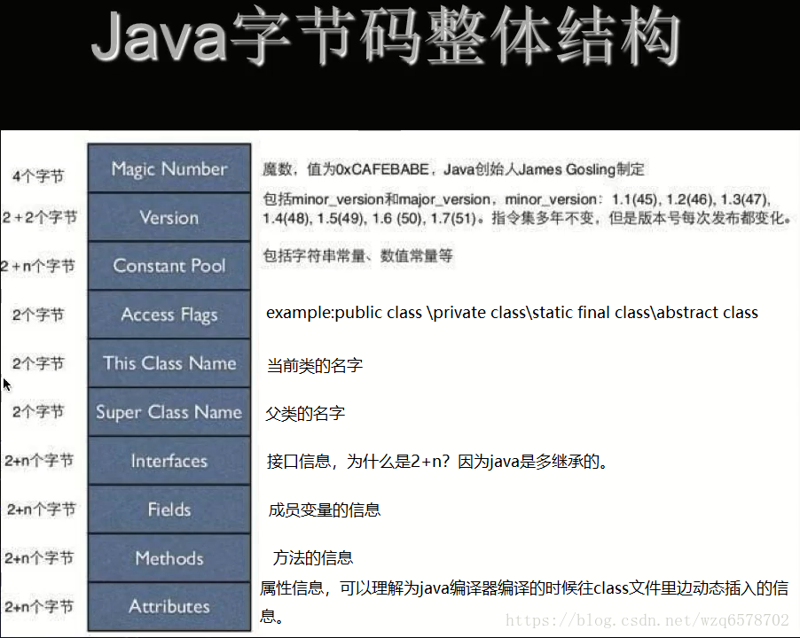
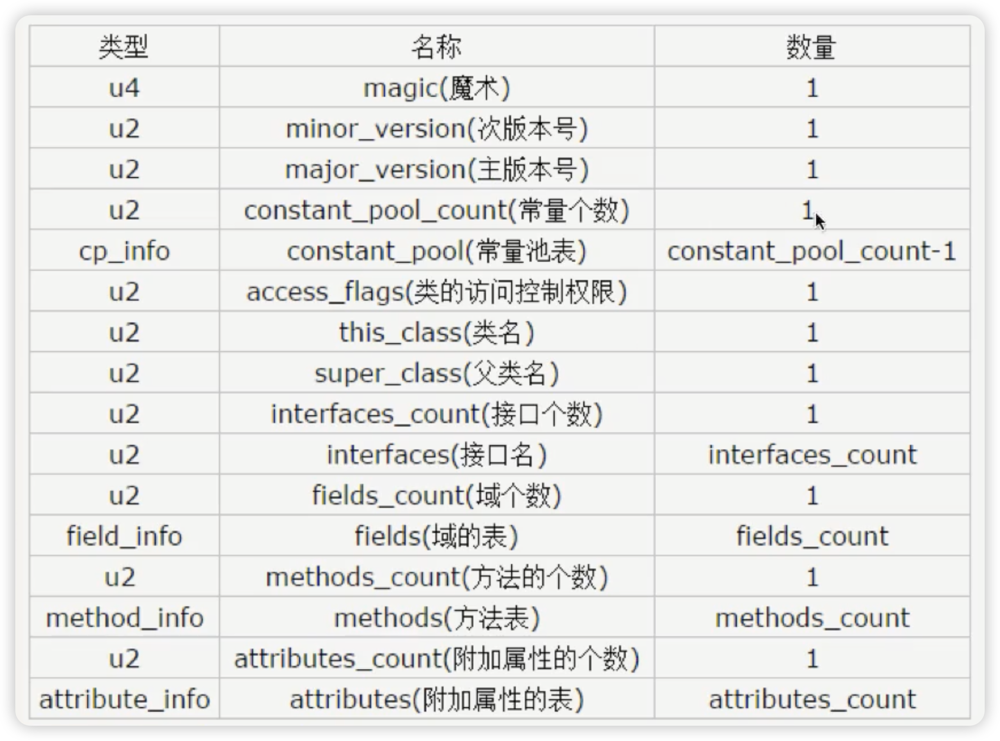
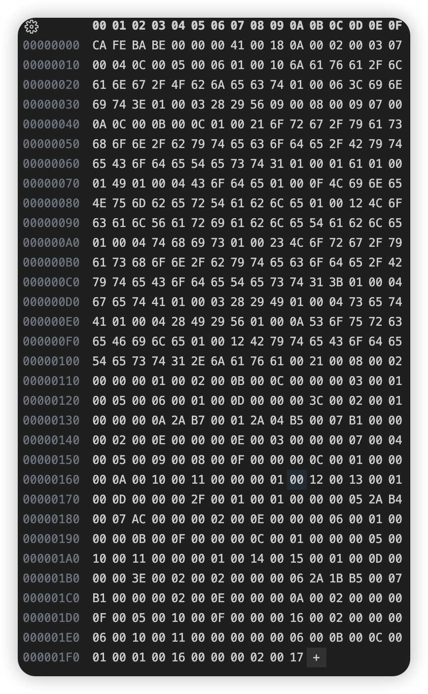
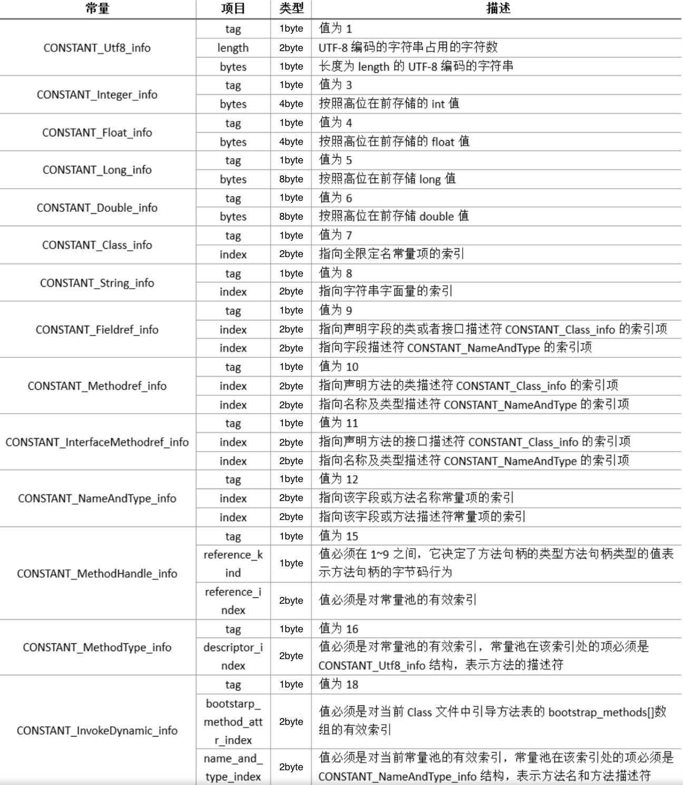
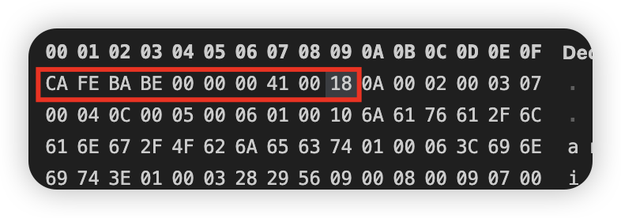

# 字节码

先来一张图表示 **Java 字节码整体结构**







使用 javap -verbose 命令分析一个字节码文件时，将会分析字节码文件的魔数、版本号、常量池、类信息、类的构造方法、类中的方法信息、类变量与成员变量等信息

对一个 Java 类进行编译，然后使用十六进制的方式打开这个 .class 文件，得到如下的图：

```java
public class ByteCodeTest1 {

    private int a = 1;

    public ByteCodeTest1() {
    }

    public int getA() {
        return a;
    }

    public void setA(int a) {
        this.a = a;
    }
}
```


十六进制数据：




## 魔数

所有的 .class 文件字节码文件的前4个字节都是魔数，魔数值是固定的：0xCAFEBABE

## 版本号

魔数之后的四个八位字节分表代表的是次版本号和主版本号 00 00 00 41，次版本号是0，主版本号是 65，表示用的是 JDK 21 编译的这个文件

## 常量池(constant pool)

紧接着主版本号之后的就是常量池的入口。一个 Java 类中定义的很多信息都是由常量池来维护和描述的。可以将常量池看作是 Class 文件的资源仓库，比如说 Java 类中定义的方法与变量信息，都是存储在常量池中。常量池中主要存储两类常量：字面量与符号引用

- 字面量

  > 字面量如文本字符串，Java 中生命为 final 的常量值等

- 符号引用

  > 符号引用如类和接口的全限定名，字段的名称和描述符，方法的名称和描述符等。

- 常量池的总体结构

  > Java 类所对应的常量池主要由常量池数量与常量池数组（表结构）这两部份共同构成。常量池数量紧跟在主版本号后面，占据2个字节；常量池数组则紧跟在常量池数量之后。常量池数组与一般的数组不同的是，常量池数组中不同的元素类型、结构都是不同的，长度当然也就不同；但是，每一种元素的第一个数据都是一个u1类型，该字节是个标志位，占据1个字节。JVM 在解析常量池时，会根据这个u1类型来获取元素的具体类型
  >
  > **值得注意的是，常量池数组中元素的个数 = 常量池 - 1 （其中0暂时不使用），目的是满足某些常量池索引值的数据在特定情况下需要表达【不引用任何一个常量池】的含义；根本原因在于，索引为0也是一个常量（保留常量），只不过它不位于常量表中，这个常量就对应 null 值，所以，常量池的索引从1而非0开始。**


知道了常量池的数量，那么反应在16进制的 .class 文件中，到哪才会结束呢，需要对照下面的这张表来一一对应





根据上面的十六进制和 Class 文件结构常量池表两张图分析下这个十六进制是如何表示的：

> 
>
> 上面红框的这几个之前已经说过了，分别代表：
>
> CA FE BA BE：魔数
>
> 00 00 00 41：次版本号和主版本号
>
> 00 18：常量池个数
>
> 接下来就是：
>
> 0A：转换成十进制数是 10，在上面的表中可以查到有两个 u2，分别占两个字节，那么就是接下来的 00 02 00 03
>
> 07：转换成十进制数是 07，在上面的表中可以查到有一个 u2，占据两个字节，那么就是接下来的 00 04
>
> 0C：转成十进制数是 12，在上面的表中可以查到有两个 u2，分别占两个字节，那么就是接下来的 00 05 00 06
>
> 01：转换成十进制数是 01，在上面的表中可以查到有一个 u2，占据两个字节，那么就是接下来的 00 10，**00 10 转成十进制数就是 16，那么接下来需要数 16 个字节，都属于这个表的内容，一直到第四行的 74**
>
> 接下来又是 01，重复上面的步骤，以此类推。。。


# 栈帧

栈帧是一种用于帮助虚拟机执行方法调用与方法执行的数据结构

栈帧本身是一种数据结构，封装了方法的局部变量表、动态链接信息、方法的返回地址以及操作数栈等信息

- 动态链接

  > 动态链接：比如有两个类 A 和 B，在 A 中调用了 B，那么在编译状态下 A 是无法知道 B 的地址的，只有在加载或者使用的时候才知道，因此才会有符号引用和直接引用

- 符号引用和直接引用

  > 常量池中可以看到，A 调用 B，那么在 A 的常量池中就会维护一个 B 的全局限定名，在运行时，如果引用了 B 的属性或者方法等等，就会将符号引用转为直接引用


