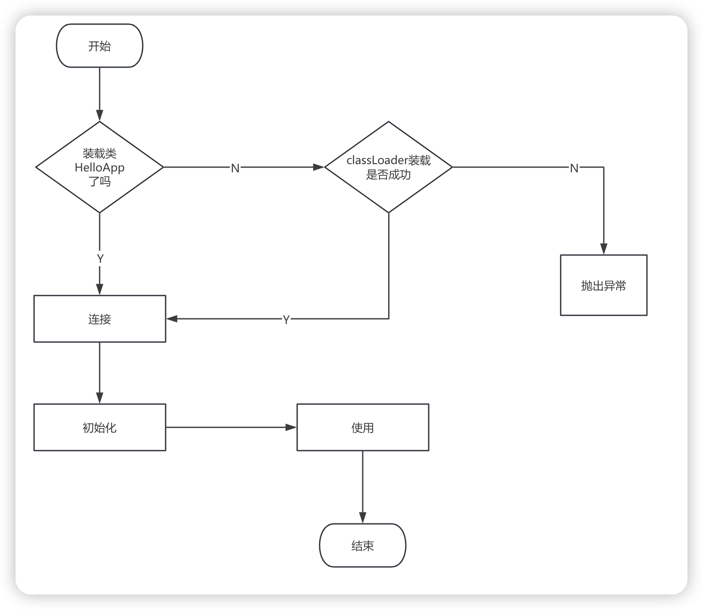
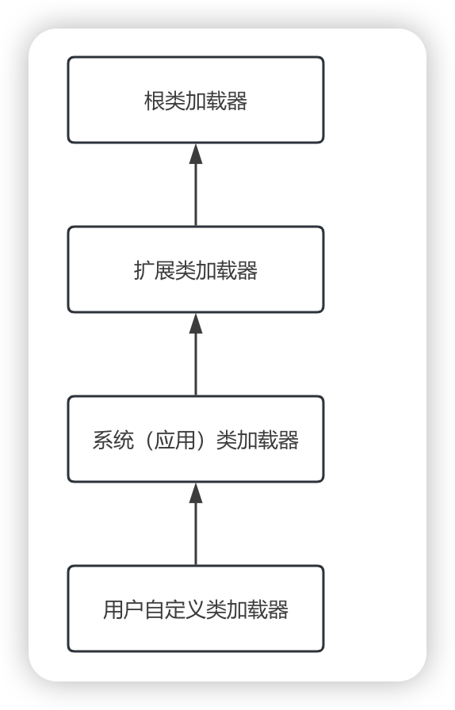

# 类加载


- 在 java 代码中，类型的加载、连接与初始化过程都是在程序运行期间完成的
- 提供了更大的灵活性，增加了更多的可能性

## 类加载器深入剖析

在如下几种情况下，java 虚拟机将结束生命周期

- 执行了 System.exit() 方法
- 程序正常执行结束
- 程序执行过程中遇到了异常或错误而异常终止
- 由于操作系统出现错误而导致 java 虚拟机进程终止


## 类的加载、连接与初始化

- 加载：查找并加载类的二进制数据
- 连接：
  - 验证：确保被加载的类的正确性
  - 准备：为类的**静态变量**分配内存，并将其初始化为**默认值**
  - 解析：**把类中的符号引用转换为直接引用**
- 初始化：为类的静态变量赋予正确的初始值


- java 程序对类的使用方式可分为两种

  - 主动使用

    > 1. 创建类的实例
    > 2. 访问某个类或接口的静态变量，或者对该静态变量赋值
    > 3. 调用类的静态方法
    > 4. 反射比如： Class.forName("com.yashon.Test")
    > 5. 初始化一个类的子类
    > 6. Java 虚拟机启动时被标明为启动类的类（包含 main 方法的那个类）
    > 7. JDK 1.7 开始提供动态语言的支持

  - 被动使用

    > 除了以上七种，其他使用 Java 类的方式都被看作是对类的被动使用，都不会导致类的初始化

- 所有的 Java 虚拟机实现必须在每个类或接口被 Java 程序“首次主动使用”时才初始化他们

### 类的加载

类的加载指的是将类的 .class 文件中的二进制数据读入到内存中，将其放在运行时数据区的方法区内，然后在内存中创建一个 java.lang.Class 对象用来封装类在方法区内的数据结构

类的加载的最终产品是位于内存中的 Class 对象

Class 对象封装类类在方法区内的数据结构，并且想Java 程序员提供了访问方法区内的数据结构的接口

- 加载 .class 文件的方式

  > - 从本地系统中直接加载
  > - 通过网络下载 .class 文件
  > - 从 zip，jar 等归档文件中加载 .class 文件
  > - 从专有数据库中提取 .class 文件
  > - 将 Java 源文件动态编译为 .class 文件（比如动态代理）


**类的加载流程**



- 两种类型的类加载器

  - Java 虚拟机自带的加载器

    > 1. 根类加载器（Bootstrap）
    >
    >    该加载器没有父加载器。他负责加载虚拟机的核心类库，java.lang.Object 就是由根类加载器加载的。根类加载器从系统属性 sun.boot.class.path 所指定的目录中加载类库。根类加载器的实现依赖于底层操作系统，属于虚拟机的实现的一部份，它并没有继承 java.lang.ClassLoader 类
    >
    > 2. 扩展类加载器（Extension）
    >
    >    它的父加载器是根类加载器，它从 java.ext.dirs 系统属性所指定的目录中加载类库，或者从 JDK 的安装目录的 jre\lib\ext 子目录（扩展目录）下加载类库，如果把用户创建的 JAR 文件放在这个目录下，也会自动由扩展类加载器加载。扩展类加载器是纯 Java 类，是 java.lang.ClassLoader 的子类
    >
    > 3. 系统（应用）类加载器（System）
    >
    >    也称为应用类加载器，它的父类加载器是扩展类加载器，它从环境变量 classpath 或者系统属性 java.class.path 所指定的目录中加载类，它是用户自定义的类加载器的默认父加载器，系统加载器是纯 Java 类，是 java.lang.ClassLoader 的子类

  - 用户自定义的类加载器

    > 1. java.lang.ClassLoader 的子类
    > 2. 用户可以定制类的加载方式

​	


- 双亲委派机制

  > 在双亲委派机制中，除了 Java 虚拟机自带的根类加载器意外，其余的类加载器都有且只有一个父加载器。当 Java 程序请求加载器 loader1 加载 simple 类时，loader1 首先委托自己的父加载器加载 Simple 类，如果父加载器能加载，则由父加载器完成加载任务，否则才由加载器 loader1本身加载 Simple 类

- 类加载器并不需要等到某个类被“首次主动使用”时再加载它

  > 比如在类 ClassLoadingTest1 中，MyChild1.str，使用的是父类变量，并没有使用 MyChild1 这个类，但是通过日志可以看到 MyChild1 这个类被加载了

  

### 类的连接

#### 类的验证

类被加载后，就进入连接阶段。连接就是将已经读入到内存的类的二进制数据合并到虚拟机的运行时环境中去。

- 类的验证的内容

  > 1. 类文件的结构检查
  > 2. 语义检查
  > 3. 字节码验证
  > 4. 二进制兼容性的验证

#### 类的准备

在准备阶段，Java 虚拟机为类的静态变量分配内存，并设置默认的初始值。例如对于以下的 Simple 类，在准备阶段，将为 int 类型的静态变量 a 分配 4 个字节的内存空间，并赋予默认值 0，为 long 类型的静态变量 b 分配 8 个字节的内存空间，并且赋予默认值 0.

```java
public class Simple {
  private static int a = 1;
  public static long b;
  
  static {
    b = 2;
  }
  ...
}
```

### 类的初始化

在初始化阶段，Java 虚拟机执行类的初始化语句（**<font color = 'red'> 这个初始化过程是根据程序员写的代码顺序进行初始化的，参考：ClassLoadingTest6 这个类的执行结果</font>**），为类的静态变量赋予初始值。在程序中，静态变量的初始化有两种途径：1）在静态变量的声明处进行初始化；2）在静态代码块中进行初始化。例如在以下代码中，静态变量 a 和 b 都被显示初始化，而静态变量 c 没有被显示初始化，它将保持默认值 0

```java
public class Simple {
  private static int a = 1;
  public static long b;
  public static short c;
  
  static {
    b = 2;
  }
}
```

- 类的初始化步骤：

  > 1. 假如这个类还没有被加载和连接，那就先进行加载和连接
  > 2. 假如类存在直接父类，并且这个父类还没有被初始化，那就先初始化直接父类
  > 3. 假如类中存在初始化语句，那就一次执行这些初始化语句


- 类的初始化时机

  > 主动使用：上面提到的七种
  >
  > 被动使用：除了上述七种情形
  >
  > **当 Java 虚拟机初始化一个类时，要求它的所有父类都已经被初始化了，但是这条规则并不适用于接口**
  >
  > - 在初始化一个类时，并不会先初始化它所实现的接口
  > - 在初始化一个接口时，并并不会先初始化它的父接口
  >
  > 因此，一个父接口并不会因为它的子接口或者实现类的初始化而初始化。只有当程序首次使用特定接口的静态变量时，才会导致该接口的初始化


## ClassLoader

### 获得 ClassLoader 的途径


- 获得当前类的 ClassLoader

  ```java
  clazz.getClassLoader();
  ```

- 获得当前线程上下文的 ClassLoader

  ```java
  Thread.currentThread().getContextClassLoader();
  ```

- 获得系统的 ClassLoader

  ```java
  ClassLoader.getSystemClassLoader();
  ```

- 获得调用者的 ClassLoader

  ```java
  DriverManager.getCallerClassLoader();
  ```

  

### 类加载器的测试

- 自定义类加载器，加载项目中的某个 .class 文件测试：**测试结果是：加载这个 .class 文件的加载器并不是自定义的类加载器加载的，而是系统（应用）类加载器加载的**，测试代码如下：

  ```java
  org.yashon.jvm.classloader.ClassLoadingTest11
  ```

- 自定义类加载器，对上个测试类进行进一步扩展，这次加载的是磁盘上的某个 .class 文件（这个 .class 文件在项目中也存在），代码编写好后，将项目中编译好的 .class 文件删除，然后调用 main 方法进行测试，发现加载磁盘上的这个 .class 文件是我们自定义的类加载器加载的，不是系统（应用）类加载器加载的。但如果将项目重新编译，将这个删除 .class 文件恢复，然后再测试这个类，发现加载磁盘上的这个 .class 文件是系统（应用）类加载器加载的。说明根据双亲委派机制，会先从父加载器加载，父加载器加载到了，那么自定义的类加载器就不用加载类，测试代码如下：

  ```java
  org.yashon.jvm.classloader.ClassLoadingTest12
  ```

  

### 命名空间

- 每个类加载器都有自己的命名空间，命名空间由该类加载器及所有父加载器所加载的类组成
- 在同一个命名空间中，不会出现类的完整名字（包括类的包名）相同的两个类
- 在不同的命名空间中，有可能会出现类的完整名字（包括类的包名）相同的两个类

```java
org.yashon.jvm.classloader.ClassLoadingTest13
```

> 1. 子加载器所加载的类能够访问到父加载器所加载的类
> 2. 父加载器所加载的类无法访问到子加载器所加载的类

代码：

```java
org.yashon.jvm.classloader.ClassLoadingTest15
```


# 类的卸载

当Simple被加载、连接和初始化后，它的生命周期就开始了。当代表Simple类的Class对象不再被引用，即不可触及时，Class 对象就会结束生命周期，Simple 类在方法区内的数据也会被卸载，从而结束 Simple 类的生命周期

一个类何时结束生命周期，取决于代表它的 Class 对象何时结束生命周期

由 Java 虚拟机自带的类加载器所加载的类，在**虚拟机的生命周期中**，始终不会被卸载。Java 虚拟机自带的类加载器包括根类加载器、扩展类加载器、系统（应用）类加载器。Java 虚拟机本身会始终引用这些类加载器，而这些类加载器则会始终引用它们所加载的类的 Class 对象，因此这些 Class 对象始终是可触及的。

**由用户自定义的类加载器所加载的类是可以被卸载的。**


